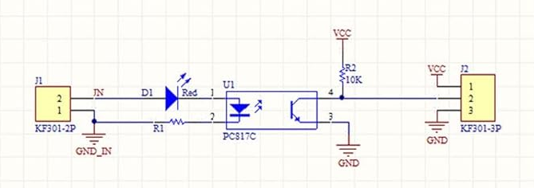

# Alternator Wave Form (from 'W' terminal) to Frequency and to RPM via PC817 optocoupler

There are small ready-to-use PCBs which include PC817 optocoupler and a circuit with one light emiting diode, two resistors and
two screw-in terminals (2-pole for input and 3-pole for output GND/OUT/VCC)

You can find them searching Internet for:

817 optocoupler isolation module

The circuit of the boards looks like this:

There are different variations of the board for 12V input signal or 24V with different pull down resistor on the board.

Select appropriate one for your alternator voltage. 

Alternator has a terminal marked 'W' which gives a sine wave form of the alternator output.

## Connections

Input from alternator:
- Alternator ground to Board '-' INPUT on 2-pin terminal
- Alternator 'W' to Board '+' INPUT on 2-pin terminal

Output to esp32:
- Board 3-pin output terminal GND to esp32 GND
- Board 3-pin output terminal VCC to esp32 +3.3v VCC
- Board 3-pin output terminal OUT to some analog input pin on esp32

## ESP32 code

### Interrupt counting

Attach an interrupt handler function in RISING edge to analog input pin.

Add logic to debounce interrupt. IF you do not know what 'debouncing of interrupt' you can google it.

### Debouncing interrupts

Debounce timeout. Let's say your engine RPM gauge goes to 5000 RPM and alternalor has N-poles.
And "transfer number" on an alternator belt (makes alernator RPM differ from engine RPM).
The ratio between alternator RPM and engine RPM is usually 2.5 to 1.
For example, if engine is rotating at 1000RPM and ratio is 2.5 then the alternator
spins at 2500 RPM.
Then the frequency of alternator signal can be up to

5000 * N * R / 60   Hz

Let's say there are 12 poles on alternator N = 12, R = 1.

5000 * 12 / 60 = 1000 Hz

1/1000Hz = 0.001 sec = 1 millisecond

So debouncing time of 200 microseconds should be reasonable.

### Critical section of pulse counting

On esp32 there has to be added some synchronization code on the critical section of interrupts (pulses) counting.

