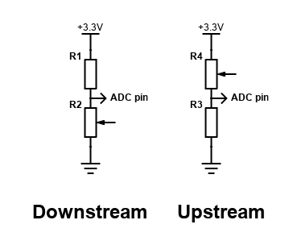

# Resistance sensor with M5Stack AtomS3-Lite

In order to measure the resistance you can measure voltage using ADC (analog) input esp32 pin on a voltage divider circuit.

Voltage divider circuit consists of:

- Resistor of a known resistance
- Sensor's resistor for which resistance is to be measured
- Known reference voltage (3.3v for esp32 case) applied to those two resistors connected in series

Voltage is measured on ADC (analog) input pin of esp32 connected in between those two resistors.

Ohm Law can be used to calculate unknown resistance from voltage drop (knowing reference voltage and reference resistor resistance)

There are two kinds of configurations for this circuit: 

Either the variable resistor is close to GND (DOWNSTREAM) or it is closer to VCC (UPSTREAM).

$$
\begin{flalign}
\text{ Downstream: } \newline \newline
&  \large {V _{ref} \over {R _{ref} + R _{sensor}}} = {V _{mes} \over {R _{sensor}}} \text{ } \Rightarrow \text{ }
 R _{sensor} = {R _{ref} {V _{mes} \over {V _{ref} - V _{mes}}}} &
\end{flalign}
$$

$$
\begin{flalign}
\text{ Upstream: } \newline \newline
&  \large {V _{ref} \over {R _{ref} + R _{sensor}}} = {V _{mes} \over {R _{ref}}} \text{ } \Rightarrow \text{ }
 R _{sensor} = {R _{ref} {{V _{ref} - V _{mes}} \over V _{mes}}} &
\end{flalign}
$$

## esp32 ADC

esp32 ADC is not the best:

- The ESP32 has two 12-bit ADCs
- Noisy (can be corrected by statistical sampling which will reduce sampling rate for accurate measurements)
- Non-linear (can be corrected by polynomial approximation)
- Almost ignores ranges < 0.14v and > 2.6v
- The ESP32 ADC can measure voltage levels between 0 V and 3.3 V. The measured voltage is assigned a value between 0 and 4095, with 0 V corresponding to 0 and 3.3 V corresponding to 4095
- ADCs in the esp32 have an attenuator stage at their inputs; the suggested range for 11Db attenuation is 2600mV at best (even though the ADC's range is 0-3.3v)
- However, the output can be made accurate to within 1% on input range of 0.14 to 2.6 volts

## For precise measurements use external ADC

Examples:  
- ADS1115  https://docs.m5stack.com/en/unit/vmeter
- INA219   https://www.adafruit.com/product/904

## Resistance based boat sensors

There are two types of commonly used resistance based sensors:
- European 0-190 ohms range (often 10-180 ohms working range)
- American Standard 240-33 ohms

Examples:

- Fuel level (10-180 Ohm or 0-190 Ohm range)
- Oil pressure 
- Rudder position (10-180 Ohms)
- Trim

Constraints for selecting a reference resistor size for these types of sensors:

$$
\begin{flalign}
& V _{ref} = 3.3 \newline & 
8 \lt  R _{sensor} \lt 240  \newline &
0.14 \lt  V _{mes} \lt 2.6 &
\end{flalign}
$$

Appropriate sizes are (in Ohms):

$$
\begin{flalign}
& \text{ Upstream: } \newline &
15  \lt  R _{ref} \lt 33 &
\end{flalign}
$$

$$
\begin{flalign}
& \text{ Downstream: } \newline &
68  \lt  R _{ref} \lt 220 &
\end{flalign}
$$

Pick up resistor with higher tolerance.

